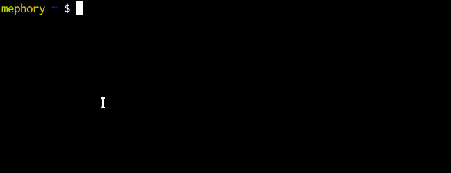

# vselect
visually select a rectangular area of an image



## Usage

```
vselect [OPTION]... FILENAME

OPTIONS
    -f FORMAT    specify an output format
```

### Specifying the output format
The output format can be any string, where the following substrings will be
replaced by the corresponding value of the selected rectangle:
```
    %l / %x  left side
    %t / %y  top side
    %r       right side
    %b       bottom side
    %w       width
    %h       height
```

The default format is the default geometry syntax imagemagick uses:
`%wx%h+%x+%y`

### Keyboard and mouse bindings

```
q            quit
arrow up     zoom in
arrow down   zoom out
left mouse   select rectangle
middle mouse move image
right mouse  confirm and exit
```


## Examples

### Crop an image
```sh
convert image.png -crop $(vselect image.png) cropped_image.png
```

### Draw red rectangle over image
```sh
convert image.png -fill transparent -stroke red \
-draw "rectangle $(vselect image.png -f '%l,%t %r,%b')" out.png
```
